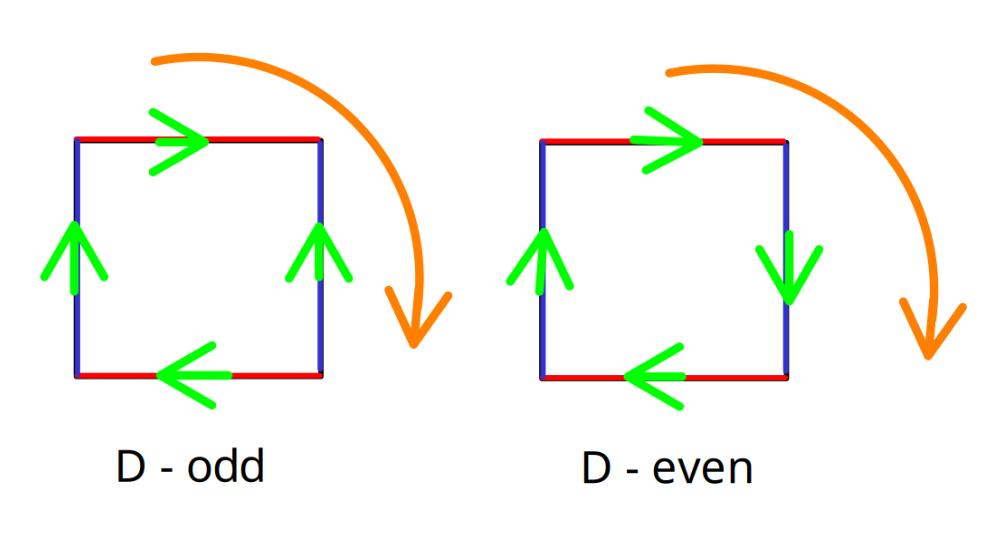
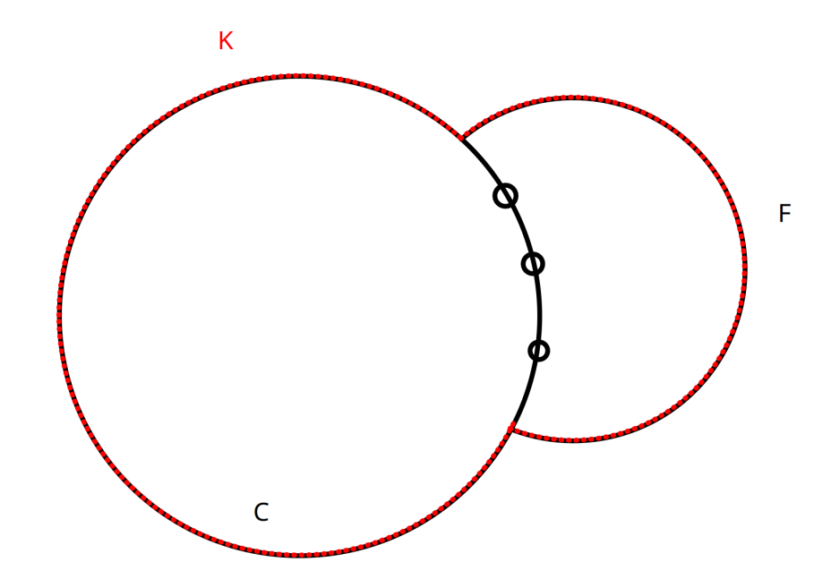

# Basic definitions

We will be having a graph $G = (V,E)$, where $E \subseteq \binom{V}{2}$. Now we should know what a cycle is $C_{x}$, path $P_{y}$ and a complete graph $K_{z}$. Also we should now what is $\deg_{g}(v)$ for a vertex $v \in V$. Next we will provide few more definitions:

- A **walk** is a sequence $v_{1}e_{1}v_{2}e_{2} \dots v_{n}$ where $e_{k} = (v_{k},v_{k+1})$. We will call a walk *closed* if $v_{1} = v_{n}$.
- A **trail** is walk if $\forall i \neq j : e_{i} \neq e_{j}$.
- A **path** is if $\forall i \neq j : v_{i} \neq v_{j}$.

Also we should have the knowledge about what is an *adjecent matrix* of a graph and that $A^{k}_{ij}$ stands for the number of walks of length $k$ between $v_{i}$ and $v_{j}$.

- **Eulerian trail** is closed trail visiting each vertex and each edge.
- $G$ is *eulerian* if$G$ admits a closed eulerian trail.

## Theorem

$G = (V,E)$ is graph and is eulerian iff $G$ is connected and each degree is even.

### Proof

For the proof we will have following observation:

#### Observation

$H = (W,F), F \neq \emptyset$ each degree even. Then $F$ can be decomposed into cycles.

##### Proof of observation

This can be seen rather easily.

And then we decompose the graph and follow the path by the cycles.

$\Box$

Now we will show an example of a [vector space of cycles](https://en.wikipedia.org/wiki/Cycle_space).

==This was mentioned in LP.==

And next is example of a **cut space**. For that we need to define an edge cut. That is $\{E' \subseteq E, E' \text{ edge cut}\}$ if $\exists V' \subset V$ such that $E' = \{e \in E, |E \cap V'| = 1\}$.

### Observation

A subspace of $\mathbb{F}_{2}^{E}$ is generated by a rows of $I_{t}$ and is equal to

$$
\{\chi_{E'}, E' \in \text{ cut space of } G\}
$$

# Matroids

## Definition

$(X, \mathcal{S})$, $\mathcal{S} \subseteq 2^{X}$ is *matroid* if following properties hold:

1.  $\emptyset \in \mathcal{S}$
2.  **heredity** $A \in \mathcal{S} \land B \subseteq A \Rightarrow B \in \mathcal{S}$
3.  *exchange axiom*

$$
U,V \in \mathcal{S}, |U| > |V| \Rightarrow \exists x \in U \setminus V \text{ s. t. } V \cup \{x\} \in \mathcal{S}
$$

- Alternatively we have $3'$ which is that $A \subseteq X$ all maximal (with respect to $\subseteq$) subsets of $A$ from $\mathcal{S}$ have the same cardinality.

### Observation

Th $3$ of basic definition is $\Leftrightarrow$ to the $3'$

### Conclusion

Matroids are exactly hereditary systems where rank function can be defined.

## Definition

$\mathcal{M} = (X, \mathcal{S})$ matroid then the rank function $r_{m} : 2^{X} \to \mathbb{N}$ is defined:

$$
r_{m}(A) = |I|, I \text{ is maximal } (\subseteq) \text{ subset of } A \text{ in } \mathcal{S}
$$

### Example

$M$ matrix over field $\mathbb{F} (\mathbb{R}, \mathbb{Q}, \mathbb{F}_{2})$. $X$ is the set of the columns of $M$ and $\mathcal{S} = \{Y \subseteq X, Y \text{ is linearly independent over } \mathbb{F}_{2}\}$.

### Observation

$(X, \mathcal{S})$ is then a matroid also known as **vectorial matroid**.

#### Proof

	$(1)$ and $(2)$ are simple to show and $(3)$ follows form *Steinitz exchange theorem*.

$\Box$

## Terminology

$\mathcal{M} = (X, \mathcal{S})$ matroid. Then elements of $\mathcal{S}$ are *independent sets of* $\mathcal{M}$.

## Definition

$(X, \mathcal{S}), (Y, \mathcal{A})$ are matroids. These matroids are **isomorphic** if $\exists f : X \longmapsto Y$ a *bijection* so that $X \supseteq A \in \mathcal{S}$ iff $f(A) \in \mathcal{A}$.

## Definition

$\mathcal{M} = (X, \mathcal{S})$ is **representable** over field $\mathbb{F}$ if $\mathcal{M}$ is isomorphic to a vectorial matroid of a matrix over $\mathbb{F}$.

$B \in \mathcal{S}$ is a **basis** of $(X, \mathcal{S})$ if $|B| = r(X)$ or by words $B$ is maximal (w.r.t. $\subseteq$) independent subset of $X$.

## Theorem

$r : 2^{X} \to \mathbb{N}$ is rank function of a matroid iff

- $(R1)$ $r(\emptyset) = 0$
- $(R2)$ $r(Y) \leq r(Y \cup \{y\}) \leq r(Y) + 1$
- $(R3)$ $r(Y \cup \{y\}) = r(Y \cup \{z\}) = r(Y) \Rightarrow r(Y) = r(Y \cup \{y,z\})$

### Proof

Firstly we show that for every matroid these properties hold. $(R1)$ is simple. $(R2)$

- $|B| = r(Y); B$ is max independent subset of $Y \cup \{y,z\}$ since any extension by $1$ element is dependent.
- Second implication:
- Let $\mathcal{S} = \{A \subseteq X; |A| = r(A)\}$. We show $(X, \mathcal{S})$ matroid. (1) is easy, (2) If $A \in \mathcal{S}$ and $A' \subset A, |A'| > r(A')$ (for contradiction) then $r(A) \leq r(A') + |A' \setminus A|$ by $(R2)$ it is $< |A|$ and that is cotnradiction.
- It remains to consider $|A'| < r(A')$ for a contradiction.
- {#} repeated aplication of $(R3)$.

$$
\Box
$$

## Theorem

$r: 2^{x} \to \mathbb{N}$ is rank function of a matroid iff

- $(R1')$ $) \leq r(Y) \leq |Y|$
- $(R2')$ $Z \subseteq Y \Rightarrow r(Z) \leq r(Y)$ *monotone*
- $(R3')$ $r(Y \cup Z) + r(Y \cap Z) \leq r(Y) + r(Z)$ *submodularity*

**Matroids are exactly set systems where rank function is non-negative, monotone and submodular.**

### Proof

- (1) $(R1')$, $(R2')$, $(R3')$ holds for matroids.
- $(R1')$ follows from $(R1,2)$
- $(R2')$ follows from $(R2)$
- ==The rest is left out.==

## Definition

$$
f : 2^{x} \to \mathbb{R}, x \in X \\
\Delta f_{x} : 2^x \to \mathbb{R} \\
\Delta f_{x} (T) = f(T \cup \{x\}) - f(T)
$$

$f(T)$ is value of $T \subseteq X$ so $f_{x}$ is non-increasing for $x \in X$.

## Theorem

$f : X \to \mathbb{R}$ is **submodular** iff $(\forall x \in X) \Delta f_{x}$ is non-increasing iff

$$
\forall (U \subseteq X | y,z \in X \setminus U) (f(U \cup \{y\}) + f(U \cup \{z\})) \geq f(U) + f(U \cup \{y,z\})(\star)
$$

### Proof

1.  Submodularity implies $(\star)$, thus easy.
2.  We want $f(Y) + f(Z) \geq f(Y \cup Z) + f(Y \cap Z)$. And we will proceed by induction on $|Y \bigtriangleup Z|$:
    1.  $|Y \bigtriangleup Z | \leq 2$ implies $(\star)$.
    2.  $|Y \bigtriangleup Z| \geq 3$ *wlog* $|Y \setminus Z| \geq 2$:

$$
t \in Y \setminus Z : f (Z \cup Z) - f(Y) \geq^{(+)} f(Y \setminus \{t\} \cup Z) - f(Y \setminus \{t\}) \leq^{(++)} f(Z) - f(Y \cap Z)
$$

Both $(+)$ and $(++)$ are submodularity, where induction assumptions can be used.

$$
\begin{array}{rll}
(+) && |Y \bigtriangleup (Y \setminus\{t\} \cup Z)| < |Z \bigtriangleup Z| \\
(++) && |(Y \setminus \{t\}) \bigtriangleup Z| < |Y \bigtriangleup Z|
\end{array}
$$

$$
\Box
$$

# Greedy Algorithm

$$
(X, \mathcal{S}), X \in \{1, \dots, n\}, w : X \to \mathbb{Q}
$$

## Combinatorial Optimization

Find $A \in \mathcal{S}$ so that $w(A) = \sum_{i \in A} w(i)$ is maximized.

- Notation: $w(i) = w_{i}$
- Assume: $w_{1} \geq w_{2} \geq \dots \geq w_{n}$. So we are finding $m$ max so that $w_{m} =0$.

### Algorithm

1.  $J := \emptyset$
2.  for $i = 1, 2, \dots, m$ do
    1.  if $J \cup \{i\} \in \mathcal{S}$
        1.  $J = J \cup \{i\}$

## Theorem

$(X, \mathcal{S})$ be non-empty, hereditary then **GA** works for each $w:X \to \mathbb{Q}$ iff $(X, \mathcal{S})$ is a matroid.

### Proof

Firsty we will proof “$\Rightarrow$”. We will do it by contradiction that $(X, \mathcal{S})$ is not a matroid, but because it has to be non-empty and hereditary it means it must not satisfy the $3$ or $3'$ axiom.

- $A, B \subseteq Z \subseteq X; A, B \in \mathcal{S}$ max subsets of $Z$ in $\mathcal{S}$ with respect to “$\subseteq$”.
- Assume $|A| > |B|$.
- Define $w : X \to \mathbb{Q}^{+}$ as follows:

$$
w(x) = \left\{
\begin{array}{lll}
x\in B && w(x) = b \in \mathbb{Q}^{+} \\
x \in A \setminus B && w(x) = a \in \mathbb{Q}^{+} \\
x \notin A \cup B && w(x) = 0
\end{array}
\right.
$$

- Assume $b > a$ thus GA will output $B$.
- But if $|A \setminus B| \cdot a > |B \setminus A| \cdot b$ then $w(A) > w(B)$. And that is *contradiction*.
    1.  $a > \frac{|B \setminus A|}{|A \setminus B|} \cdot b$
    2.  $a < b$

Now we will proof the other part “$\Leftarrow$”. We will use a $z'$ characteristic vector of output of GA. $T_{i} = \{1, \dots, n\}; i \in 1,\dots ,m$ denoted by 0. And use of lemma:

#### Lemma

$z'(T_{i}) \geq r(T_{i})$ where $r(T_{i}) = \text{rank of } T_{i} \text{ in } (X, \mathcal{S})$. Hence $r(T_{i})$ is cardinality of $\max(\subseteq)$ independent subset of $T_{i}$. Moreover $z'(T_{i}) =^{\text{def}} |0 \cap T_{i}|$.

##### Proof of lemma

By contradiction assume $z'(T_{i}) < r(T_{i})$ then $0 \cap T_{i}$ is not $\max(\subseteq)$ independent subset of $T_{i}$. But then one element of $T_{i}$ would be added to 0 by GA.

$$
\Box
$$

Now let $z$ be a characteristic vector of optimal subset $S$ of $\max(A), A \in \mathcal{S}$.

$$
w^{T}z = \sum_{i=1}^{m} w_{i}z_{i} = \sum_{i=1}^{m}w_{i}(z(T_{i}) - z(T_{i-1}))
$$

where $z(T_{i}) = |S \cap T_{i}|$. Here wlog assume $n = m$.

$$
= \sum_{i=1}^{m-1} (w_{i} - w_{i-1})z(T_{i}) + w_{m} z(T_{m}) \leq^{\ast} \sum_{i=1}^{m-1}(w_{i} - w_{i-1}) z'(T_{i}) + w_{m} z'(T_{m}) = w^Tz'
$$

Here at $\leq^{\ast}$ we used the fact that $z(T_{i}) \leq r(T_{i})$ for each $i \leq m$. But by lemma $z'(T_{i}) \geq z(T_{i})$.

$$
\Box
$$

### Relation with spanning tree

Reverse the ordering of elements of $x$.

#### Observation

GA solves also the following:

$$
\max \left( \sum_{i=1}^{n} w_{i}z_{i} ; (\forall Y \subseteq X)\left( \sum_{i\in Y} z_{i} \leq r(Y)\right)\right)
$$

This is a **linear problem**. $0 \leq z \leq \mathbb{R}^{n}$ Because in proof we have never used the property that $z \in \{0,1\}$.

#### Corollary *(Edmonds)*

$(X, \mathcal{S})$ matroid then $\text{conv}(\chi_{A}, A \in \mathcal{S}) = \mathcal{P}_{(X, \mathcal{S})} = \{z \geq 0, (\forall A \subseteq X)(z(A) \leq r(A))\}$ where $z(A) = \sum_{x \in A} z_{x}$. And $\mathcal{P}_{(X, \mathcal{S})}$ is a polytope.

### Duality

Let $\mathcal{M} = (X, \mathcal{S})$ be a matroid. We can define its **dual** $\mathcal{M}^{\ast} = (X, \mathcal{S}^{\ast})$ by $Y \subset X, Y \in \mathcal{S}^{\ast}$ iff $r(X \setminus Y) = r(X)$. Equivalently the bases of $\mathcal{M}^{\ast}$ are exactly components of bases of $\mathcal{M}$.

### Theorem

$\mathcal{M}$ matroid, then $\mathcal{M}^{\ast}$ is also a matroid. *Without proof.*

### Theorem

$G$ is a planar graph then $\mathcal{M}^{\ast}_{G} = \mathcal{M}_{G^{\ast}}$. Where $G^{\ast}$ is a geometric dual of $G$.

### Terminology

Notions of dual matroid are called **co-notions**.

### Definition

$\mathcal{M}$ dependent sets are called **circuits** of $\mathcal{M}$.

Co-circuits are circuits of the dual matroid.

### Observation

$(X, \mathcal{S})$ is matroid and is uniquely determined by its set of circuits.

# Perfect matching

==Basic definitions and algorithms were omitted.==

## Observation

$M,N$ are matchings. Then $M \bigtriangleup N$ has each degree $\leq 2$. And it is built by alternating cycles and paths. **$N$-augmenting** is switching pairing.

## Observation

$M$ max iff there are no $M$-augmenting paths.

The algorithm is to “find” an augmenting path and switch its pairing. **Edmonds Blossom algorithm**.

## Observation

If $G$ has a perfect matching then $|A| \geq \text{oc}(G \setminus A)$, where $\text{oc}$ is the number of odd components.

## Definition

$\text{oc}(G \setminus A) - |A|$ is called **“defect of $A$”**.

## Theorem

$\max \{|M|, M \text{ matching}\} = \min \{1/2 (|V| - \text{oc}(G \setminus A) + |A|); A \subseteq V\}$.

### Proof

- $\max \leq \min$ is straightforward.
- The other way around is by using Edmonds Blossom algorithm.

$$
\Box
$$

## Min-Max Theorem

==Missing==

## Edmonds-Galloiré decomposition

$G = (V, E)$ graph and $B \subseteq V$ is the set of vertices that at least one maximum matching does not cover them.

$$
A = \{v \in V \setminus B; \exists x \in B : \{x, v\} \in E\} \\
C = V \setminus (A \cup B)
$$

1.  Each component $H$ of $B$ is hypomatchable i.e. $H \setminus \{v\}$ has a perfect matching for each $v \in V(H)$.
2.  Each maximal matching $M$ of $G$ contains perfect matching of $G$ restricted to $C$ and each vertex of $A$ is matched to $B$ and each component of $B$ contains size of $\frac{|V(B)| - 1}{2}$ edges of $M$.

In statistical physics perfect matchings are called **dimer arrangements**.

## Ising model

$G = (V, E)$ $s: V \to \{1, \dots \}$ state and $w: E \to \mathbb{Q}$ coupling constants. Energy of $s$ is $E(s) = -\sum_{\{x,y\}=e \in E} s(x)s(y)w(e)$.

- Find ground state energy. Which is the state of minimal energy.
- Partition function: $z(G, w, x) = \sum_{\text{state }s}x^{-E(s)}$ *it is generating function*. For example $x \sim e^{B T}$ where $T$ is temperature.

### Reformulation of Ising model

Define $V(s) = \{v \in V, s(v) = 1 \}$ and $E(s) = \{e, |e \cap V(s)| = 1\}$. We can see that $E(s)$ is an edge cut.

Edge cuts correspond to pairs of states.

$$
E(s) = \sum_{\{x,y\} \in E}-s(x)s(y)w(e) \\
e \in E(s) : e\text{ contributes } w(e) \text{ to } E(s) \\
e \notin E(s) : e\text{ contributes } -w(e) \text{ to } E(s)
$$

$$
E(s) + \sum_{e \in E}w(e) = 2 \sum_{e \in E(s)}w(e) = 2w(E(s))
$$

Where $\sum_{e \in E}w(e)$ is a constant.

Finding the energy of ground state is equal to finding weight of min cut (*NP-complete* for rational weights).

## Theorem

Max-cut is polynomial for planar graphs.

### Proof

- Embedded $G$ to the plane, let $G^{\ast}$ be geometric dual to $G$. Max-cut of $G$ is the same as Max even set of edges of $G^{\ast}$.
- Max even set problem is polynomial for general graphs by reduction to the weight perfect matching in an auxiliary graph.
- $M \subseteq E$ matching
- $C \subseteq E$ is an edge cut
- To find maximum matching is polynomial.
- To find max weight perfect matching polynomial.
- To solve max cut is NP-complete. But polynomial for planar graphs.

$$
\Box
$$

## Story of efficient enumeration

A matrix $n \times n$ and Gaussian Elimination can be used to compute $\det A = \sum_{\pi \in P}(-1)^{\text{sign}(\pi)} \prod_{i = 1}^{n} A_{i\pi(i)}$.

But for computing $\text{per} A = \sum_{\pi \in P} \prod_{i = 1}^{n} A_{i\pi(i)}$ we find that it is hard *NP-complete* problem. It is called **permanent**. The question now is: Can we compute permanent by computing determinant?

$$
\mathcal{P}(G, x, w) = \sum_{P \text{ perf. matching}} x^{w(P)}
$$

$$
\mathcal{E}(G, x, w) = \sum_{E' \text{ even}} x^{w(E')}
$$

$$
\mathcal{S}(G, x, w) = \sum_{C \text{ edge cut}} x^{w(C)}
$$

$$
\mathcal{Z}(G, x, w) = \sum_{p: V \to \{-1,1\}} x^{E(s)}
$$

$$
E(s) = \sum_{\{x, y\} = e \in E} w(e) s(x) s(y)
$$

### Lemma

$$
E(s) + \sum_{e \in E} w(e) = 2w(C_{s}) (\ast)
$$

where $C_{s}$ is edge cut defined by $s$.

### Theorem

$G$ planar:

$$
\mathcal{Z}(G) \equiv^{(1)} \mathcal{S}(G) \equiv^{(2)} \mathcal{E}(G^{\ast}) \equiv^{(3)} \mathcal{P}(G_{\Delta}^{\ast})
$$

Also binary operator $\equiv$ means it is same in efficiency of calculations.

#### Proof

- $(1)$ follows from $(\ast)$
- $(2)$ geometric dual (we are using planarity)
- $(3)$ construction of $G_{\Delta}$ (each vertex to triangles)

$$
\Box
$$

### Theorem

$G$ planar, $w : E \to \mathbb{Z}$. $\mathcal{P}(G, x, w)$ can be calculated in polynomial time. $|w(e)| \leq (|E| + |V|)^{c}, c$ constant. So that the weights are integers by a polynom in $|G|$.

### Corollary

With the same conditions $\mathcal{S}(G, x, w), \mathcal{E}(G, x, w), \mathcal{Z}(G, x, w)$ can be computed efficiently.

Hence for planar graphs we know:

- \# max cuts
- \# min cuts
- \# medial cuts
- \# average cuts
- and so on …

Max cut polynomial for planar graphs nad general weights.

### Method (Per-Det method)

Introduce signs for perfect matching:

$$
\mathcal{P}(G, x, w) = \sum_{P \text{ perfect matching}} (-1)^{\text{\#}(P)} x^{w(P)}
$$

### Kasteleyn

$G$ graph, $D$ orientation of $G$. $M_{0}$ fixed matching.

$$
\text{sign}(D, M_{0}, P) = \#(P) =^\text{def} \# D-\text{even cycles of } M_{0} \bigtriangleup P
$$

Now the signed version of $\mathcal{P}(G, x , w)$ is:

$$
\mathcal{P}(G, D, M_{0}, x, w) = \sum_{P \text{ perfect matching }} (-1)^{\text{sgn}(D, M_{0}, P)}x^{w(P)}
$$

## Theorem

1.  For general graph $\mathcal{P}(G, D, M_{0}, x, w)$ is det-type expression called **Pfaffiah**. That means there exists and efficient algorithm!
2.  $G$ planar has orientation $D$ so that ALL SIGNS are equal.

### Corollary

$P(G, x, w)$ is efficiently computable for $G$ planar on restricted weights.

## Kasteleyn orientation

$G$ planara ($2$-corrected) each fase is bounded by a cycle. Make each face clockwise odd.

### Lemma

Such $D$ satisfying that any cycle $C$ is clockwise odd iff $C$ encircles an even numbers of vertices.

#### Proof

By induction on complexity of making $C$ from inner faces.

- 1.step OK since all inner faces are clockwise odd
- Inductive step Assume lemma true for $C$, we show for $k$ by going through all cases.

$$
\Box
$$

### Corollary

Such $D$ satisfies each alternating cycle with respect tot a perfect matching is clockwise odd. Thus $D$ is Kasteleyn. Which also means that $\text{sgn}(D, M_{0}, P) = 0$ for each $M_{0}$ and $P$.

Because $G$ is planar number of vertices inside has to be even since it is perfect matching and planar.

$$
\Box
$$

# Travelling Salesman (TCP) & Chinese Postman Problem (CPP)

We will show two well known problems. Both of them are on a graph $G = (V,E)$ and lengths of edges $l: E \to \mathbb{Q}^{+}$.

- CPP
    - Find shortest closed tour containing each edge. **Arc-routing**.
    - This is indeed *polynomial*.
- TCP
    - Find shortest closed tour containing each vertex.
    - This problem is *NP-complete*.

## CPP

If $G$ has all degrees even then cpp is solved by any euler tour. But what if $G$ has some odd degree? Then in any CP tours use some traverses more then once. **The goal is to find CP tour with the minimum length of repeated edges.**

## $T$-join

$G = (V,E)$ graph, $T$ is the set of vertices of odd degree ($|T|$ has to be even).

### Definition

$E' \subseteq E$ is $T$-join if in $(V,E')$ a vertex has even degree iff it does not belong to $T$.

### GOAL

CPP is equivalent to finding shortest $T$-join, where $T \subseteq V$ is the set of vertices of an odd degree.

1.  If $E$ is shortest $T$-join then $(V, E \ \dot{\cup} \ E')$ has all degrees even and thus it has an Euler tour. Hence min length of CP tour is $\leq l(E) + l(E')$.
2.  On the other hand, let $\tau$ be the shortest tour of CP.
    1.  Assume each edge of $G$ is traversed $\leq 2$ in $\tau$. Let $E'$ be the set of edge traversed exactly twice in $\tau$. Then $E'$ is a $T$-join! Hence $l(\tau) = l(E) + l(E') \geq l(E) + \text{ length of min } T \text{-join}$.
    2.  There is no edge traversed more then twice in $\tau$. Since deleting a pair of paralel edges, if at least one edge remains is eulerian graph containing $E$. This contradicts min of $\tau$.

Hence in order to solve CPP it sufficies to find min $T$-join problem.

#### Observation

The union $U$ of the shortest paths corresponding to the edge of optimal perfect matching is min $T$-join.

##### Proof

Clearly union $U$ is a $T$-join. Let $\tau$ be the min $T$-join. Then $l(\tau) \leq l(U)$. On the other hand we observe that $\tau$ is disjoint union of paths between vertices of $T$. Then we can show this by greedily finding one and deleting them.

$$
\Box
$$

## TSP

Since this problem is *NP-complete* we may only use heuristics and aproximation $2$-OPT. Thus we have some assumptions:

1.  $G$ is assumed to be complete graph.
2.  $l: E \to \mathbb{Q}^{+}$
3.  Triangle inequality in $G$. To be precise:

$$
(\forall u,v,w \in V) (l(uv) + l(vw) \leq l(uw))
$$

### Theorem

Under all 3 assumptions **Christofides heuristics** finds a TSP tour of length $\leq 3/2 \text{ OPT}$.

This is done by combining MST and pairing. All degrees are even. if $\deg(v) = 2$ then it is fine, otherwise we take a shortcut and skip the vertex.

#### Proof

- Let $H$ be OPT.
- $H - e$ is spanning tree and thus $l(T) \leq l(H)$.
- Consider alternating pairings $P_{1}, P_{2}$ $l(P_{1} \cup P_{2}) \leq l(H)$ thus one is $\leq 1/2$.

$$
\Box
$$

# Optimization problem

$$
\begin{array}{rll}
\min && f(x) \\
\text{such that} && x \in M
\end{array}
$$

Where $f(x)$ is called the **objective function**. Set $M$ is **feasible set**. Typically if the set $M$ is finite we will say it is *discrete* and if it is infinity it is *continuous*. But in some ways this is not the best definition ans many problems can be set by finite and infinite set as well in different interpretations.

For example *max network flow* can be described as a function and also as an Linear program.

## Eigen values (*vlastní čísla*)

$A \in \mathbb{R}^{n \times n}$ symmetric $(A_{ij} = A_{ji})$. Then $A x = \lambda x, \lambda \in \mathbb{R}$ where $\lambda$ is an eigen value and $x$ eigen vector. These values can be ordered in a way $\lambda_{1} \geq \lambda_{2} \geq \dots \geq \lambda_{n}$ where the first and the last eigen values are the most important.

### Rayleigh-Ritz theorem

$$
\lambda_{1} = \max_{||x||_{2} \leq 1} x^{T}Ax \\
\lambda_{2} = \min_{||x||_{2} \leq 1} x^{T}Ax \\
$$

#### Proof

- We will showcase the $\max$ part and $\min$ part is similar.
- "$\leq$" let $x_{1}$ be s.t. $Ax_{1} = \lambda_{1} x_{1}$ and $||x_{1}||_{2} = 1$.
- $\lambda_{1} = \lambda_{1}(x_{1}^{T}x_{1}) = x_{1}^{T} \lambda_{1}x_{1} = x_{1}^{T}Ax_{1} \leq \max_{||x||_{2} \leq 1} x^{T}Ax$
- "$\geq$" let $A = \mathbb{Q}^{T} \Lambda \mathbb{Q}$ where $\mathbb{Q}$ is orthogonal, $\mathbb{Q}^{T} \mathbb{Q} = I$ and $\det \mathbb{Q} = 1$.
- let $||x||_{2} = 1, y = \mathbb{Q}x$
- $x^{T}Ax = x^{T} \mathbb{Q}^{T} \Lambda \mathbb{Q} x = y^{T} \Lambda y = \sum_{i = 1}^{n} \lambda_{i} y_{i}^{2} \leq \lambda_{1} \sum y_{i}^{2} \leq \lambda_{1} ||y||_{2}$

$$
\Box
$$

## Definitions

- $x^{\ast} \in M$ is a (global) **minimum** if $f(x^{\ast}) \leq f(x) \ \forall x \in M$
- is a **strict** (global) minimum if $f(x^{\ast}) < f(x) \ \forall x^{\ast} \neq x \in M$
- is a **local minimum** if $f(x^{\ast}) \leq f(x) \ \forall x \in M \cap O_{\epsilon}(x)$ where $O_{\epsilon}(x)$ is a ball centered at $x$ with radius $\epsilon > 0$.
- is a **strict local minimum** if $f(x^{\ast}) \leq f(x) \ \forall x \neq x^{\ast} \in M \cap O_{\epsilon}(x)$.

And from now on we will be mainly focused on these properties and if they actually exist.

## Theorem

If $f$ is continuous over compact $M$ then a minimum exists.

*Without proof.*

## Classification

Lets have a problem:

$$
\begin{array}{rll}
\min && f(x) && \\
\text{s.t.} && g_{j}(x) \leq 0 && j = 1, \dots , J \\
               && h_{l}(x) = 0 && l = 1, \dots, L
\end{array}
$$

- It is **linear** if $f,g_{j}, h_{l}$ are linear.
- **unconstrained** if $M = \mathbb{R}^{n}$.
- **convex** opt if $f, g_{j}$ are convex and $h_{l}$ linear.

## Basic transforms

First simple transformation:

$$
\begin{array}{rlcrl}
\max       && f(x)       && \leftrightarrow && \min        && -f(x) \\
\text{s.t.} && x \in M &&                        && \text{s.t.} && x \in M
\end{array}
$$

More complex:

$$
\begin{array}{rlcrl}
\min        && f(x)                 && \leftrightarrow && \min         && \phi(f(x)) \\
\text{s.t.} && g_{j}(x) \leq 0 &&                        && \text{s.t.} && \varphi_{j}(g_{j}(x)) \leq 0\\
               && h_{l}(x) = 0    &&                         &&                && \mu_{l}(h_{l}(x)) = 0
\end{array}
$$

But only if $\phi$ is increasing $(z_{1} \leq z_{2} \Leftrightarrow \phi(z_{1}) \leq \phi(z_{2}))$. Also $\varphi_{j}$ are non-negativity preserving $(z \leq 0 \Leftrightarrow \varphi_{j}(z) \leq 0)$. Lastly $\mu_{l}$ is root preserving $(z = 0 \Leftrightarrow \mu_{l}(z) = 0)$.

## Unconstrained optimization

$$
\begin{array}{rll}
\min && f(x) \\
\text{s.t.} && s \in \mathbb{R}^{n}
\end{array}
$$

## Theorem : First order necessary optimality condition

Let $f(x)$ be differentiable and $x^\ast \in \mathbb{R}^{n}$ be a local extreme point. Then $\nabla f(x^\ast) = 0$ (which is the *gradient*).

Just to remind the gradient: $\nabla_{i} f(x) = \frac{\partial f(x)}{\partial x_{i}}$.

## Theorem: Second order necessary optimality condition

let $f(x)$ be twice continuous differentiable and let $x^{\ast}$ be a local minimum. Then the Hessian has to be positive semi-definite or written as $\nabla^{2} f(x^{\ast}) \succeq 0$.

## Theorem: Second order sufficient optimality condition

Let $f(x)$ be twice continuously differentiable function. If

$$
\nabla f(x^\ast) = 0 \text{ \& } \nabla^{2}f(x^\ast) \succeq 0
$$

then $x^\ast$ is a strict local minimum.

# Convexity

$$
\begin{array}{rll}
\min && f(x) \\
\text{s.t.} && s \in M
\end{array}
$$

## Definition

A set $M$ is convex if $\forall x, y \in M, \forall \lambda \in [0,1] : \lambda x + (1 - \lambda) y \in M$.

## Theorem

Let $x_{1}, \dots, x_{k} \in M$ and $\lambda_{1}, \dots, \lambda_{k} \in \mathbb{R}$ such that $0 \leq \lambda_{i} \leq 1, \sum_{i = 1}^{k} \lambda_{i} = 1, M$ is convex iff $\sum_{i = 1}^{k} \lambda_{i}x_{i} \in M$. *(This is proven by induction and algebra.)*

## Definition

$\text{conv}(M)$ is the intersection of all convex sets containing $M$.

## Definition

Two non-empty sets $N,M \subseteq \mathbb{R}^{n}$ are separable if $\exists 0 \neq a \in \mathbb{R}^{n}, b \in \mathbb{R}$ such that $a^{T}x \leq b \ \forall x \in M$ and $a^{T}x \geq b \ \forall x \in N$ and also $\neg (a^{T}x = b \ \forall x \in M \cup N)$.

## Theorem

Two sets (non-empty and convex) $N,M$ are separable iff $r_{i}(M) \cap r_{i}(N) = \emptyset$, where $r_{i}(M)$ is set of points s.t. a small enough ball $B(x) \subseteq M$ and $B(x) \subseteq \text{aff}(M)$.

## Definition

Let $M \subseteq \mathbb{R}^{n}$ be a convex set then $f: \mathbb{R}^{n} \to \mathbb{R}$ is convex iff $\forall x_{1}, x_{2} \in M, \lambda_{1}, \lambda_{2} \geq 0, \lambda_{1} + \lambda_{2} = 1$ $f(\lambda_{1}x_{1} + \lambda_{2}x_{2}) \leq \lambda_{1}f(x_{1}) + \lambda_{2}f(x_{2})$. And is strictly convex iff we put $<$ instead of $\leq$.

## Theorem

$$
f \left( \sum_{i = 1}^{k} \lambda_{i}x_{i} \right) \leq \sum_{i=1}^{k} f(\lambda_{i} x_{i}), \forall i \lambda_{i} \geq 0 \ \& \ \sum_{i = 1}^{k} \lambda_{i} = 1
$$

Or we can put there $<$ instead of $\leq$. We may also show it by defining epigraph.

## Definition

The **epigraph** $\mathcal{E}$ of $f$ is $\{(x,z) | f(x) \leq z\}$. *In other words is the subset of $\mathbb{R}^{n}$ which is "above" the function.*

## Theorem

$f$ is convex iff epigraph of $f$ is convex.

### Proof

- "$\Rightarrow$" Let $(x_{1}, z_{1}), (x_{2}, z_{2}) \in \mathcal{E}$ then $\lambda_{1}(x_{1}, z_{1}) + \lambda(x_{2}, z_{2}) = (\lambda_{1}x_{2} + \lambda_{1} x_{2}, \lambda_{1}z_{1} + \lambda_{2}z_{2})$.
- $f(\lambda_{1}x_{1} + \lambda_{2}x_{2}) \leq \lambda_{1}f(x_{1}) + \lambda_{2}f(x_{2}) \leq \lambda_{1}z_{1} + \lambda_{2} z_{2}$. Thus this is done.
- "$\Leftarrow$" $f(\lambda_{1}x_{1} + \lambda_{2}x_{2})$ now $(x_{1}, z_{1}) \in \mathcal{E} \ \forall z_{1} \ f(x_{1}) \leq z_{1}$ and $(x_{2}, z_{2}) \in \mathcal{E} \ \forall z_{2} \ f(x_{2}) \leq z_{2}$.
- $(\lambda_{1} x_{1} + \lambda_{2}x_{2}, \lambda_{1} z_{1} + \lambda_{2}z_{2}) \in \mathcal{E}$
- $\lambda_{1}z_{1} + \lambda_{2}z_{2} \geq \lambda_{1} f(x_{1}) + \lambda_{2}f(x_{2}) \geq f(\lambda_{1}x_{1} + \lambda_{2}x_{2})$

$$
\Box
$$

## Theorem

Let $M \subseteq \mathbb{R}^{n}$ be a convex set, $f$ convex over $M$. For any $b \in \mathbb{R}$ is $\{x \in M | f(x) \leq b\}$ convex. When we are having a problem $\min f(x)$ s.t. $x \in M$.

### Proof

Let $x_{1}, x_{2} \in M$ s.t. $f(x_{1}) \leq b, f(x_{2}) \leq b$. Then $f(\lambda_{1}x_{1} + \lambda_{2}x_{2}) \leq \lambda_{1} f(x_{1}) + \lambda_{2}f(x_{2}) \leq \lambda_{1} b + \lambda_{2}b = b$.

$$
\Box
$$

## Theorem: First order characterization of convex function

Let $\emptyset \neq M \subseteq \mathbb{R}^{n}$ be a convex set and let $f(x)$ be a function differentiable on an open super-set of $M$. Then $f$ is convex over $M$ iff $\forall x_{1}, x_{2} \in M: f(x_{2}) - f(x_{1}) \geq \nabla f(x_{1})^{T}(x_{2} - x_{1})$.

## Theorem: Second order characterization of convex function

Let $\emptyset \neq M \subseteq \mathbb{R}^{n}$ be a convex set and let $f(x)$ be a function twice differentiable on an open super-set of $M$. Then $f$ is convex over $M$ iff $\nabla^{2}f$ is positive semi-definite over $M$.

## Theorem

Let $f,g : \mathbb{R}^{n} \to \mathbb{R}$

1.  If $f(x), g(x)$ are convex, non-negative and non-decreasing (or both increasing) then $f(x) \cdot g(x)$ is convex.
2.  If $f(x)$ is convex, non-negative and non-decreasing and $g(x)$ is concave, positive and non-increasing then $\frac{f(x)}{g(x)}$ is convex. (*NOTE: Concave is just that $-g(x)$ is convex.*)

## Theorem

Let $f: \mathbb{R}^{n} \to \mathbb{R}^{k}$ and $g : \mathbb{R}^{k} \to \mathbb{R}$

1.  If $f_{i}(x)$ is convex for each $i = 1, \dots, k$ and non-decreasing and $g$ convex then $g \circ f$ is convex.
2.  If $f_{i}(x)$ is convex and non-increasing and $g$ convex then $g \circ f$ is convex.

One of the important results from this theorem is that if $f$ is convex then $e^{f(x)}$ is also convex.

# Convex optimization

Convex optimization is when we have a problem:

$$
\begin{array}{rll}
\min && f(x) \\
\text{s.t.} && g_{i}(x) \leq 0, i = 1, \dots, I
\end{array}
$$

and $f(x)$ and all $g_{i}(x)$ are convex.

## Theorem

For convex optimization problem

1.  Each local minimum is a global minimum.
2.  The optimal solution set is convex.
3.  If $f(x)$ is strictly convex then optimum is unique or none.

### Proof

1.  Let $x_{1}$ be a local minimum and let $x_{2}$ be s.t. $f(x_{2}) < f(x_{1})$. Then $f(\lambda x_{1} + (1 - \lambda) x_{2}) \leq \lambda f(x_{1}) + (1- \lambda) f(x_{2}) < f(x_{1})$. For large enough $\lambda$ local optimality of $x_{1}$ is violated.
2.  Let $f(x_{1}) = f(x_{2}) = \text{OPT}$ then $f(\lambda_{1} x_{1} + \lambda_{2} x_{2}) \leq \lambda_{1} f(x_{1}) + \lambda_{2} f(x_{2}) = \text{OPT}$.
3.  Suppose $x_{1} \neq x_{2}$ be two optimum solutions. Then $f(\lambda_{1} x_{1} + \lambda_{2} x_{2}) < \lambda_{1} f(x_{1}) + \lambda_{2} f(x_{2}) = \text{OPT}$

$$
\Box
$$

## Theorem

Let $\emptyset \neq M \subseteq \mathbb{R}^{n}$ be an open convex set and $f : M \to \mathbb{R}$ be convex and differentiable. Then $x^{\ast} \in M$ is an optimal solution iff $\nabla f(x^{T}) = 0$.

# Quadratic programs

Now we will showcase other types of problems which have quadratic objective function.

$$
\begin{array}{rl}
\min && x^{T} C x + d^{T}x \\
\text{s.t.} && x \in M
\end{array}
$$

This is for $C \in \mathbb{R}^{n \times n}$. Also note that $x^T C x$ can be rewritten as $\sum_{i,j} C_{ij} x_{i} x_{j}$.

## Theorem

If we have a problem that is written like this:

$$
\begin{array}{rl}
\min && x^{T} C x + d^{T}x \\
\text{s.t.} && a^{T} x \leq b
\end{array}
$$

It is *NP-hard*.

### Proof

- We can show that we may rewrite **Subset-sum problem** like this and by knowing the Subset-sum problem is NP-hard it means this one is also NP-hard.
- We will put $x_{1}, x_{2}, \dots ,x_{n} \in \mathbb{R}$ and $\alpha \in \{ \pm 1 \}^{n}$ and $\sum \alpha_{i} x_{i} = 0$.
- Then the function $\min - \sum \alpha_{i}^{2}$ s.t. $\sum \alpha_{i} x_{i} = 0$ and $-1 \leq \alpha_{i} \leq 1$ will simulate subset-sum problem.

$$
\Box
$$

# Convex cone programming

Firstly we have to define what is **cone** $C$. That is defined as $\forall x \in C : \lambda x \in C \ \forall \lambda \geq 0$.

## Definition

A **pointed** cone is a cone that does not contain a line.

Now we will look at some problems and their duals. Afterwards we will try to rewrite them so it will be easy to see, that we have indeed a cone.

$$
\begin{array}{rlcrl}
\max        && c^{T}x     && \leftarrow \text{duals} \rightarrow && \min        && b^{T} y \\
\text{s.t.} && Ax \geq b &&                                                     && \text{s.t.} && A^{T}y = c \\
               &&                 &&                                                     &&                && y \geq 0
\end{array}
$$

But $Ax \geq b$ can be rewritten as $Ax - b \geq 0$. Thus it is same as $Ax - b \in \mathbb{R}^{n}_{\geq 0}$ which is a cone called **non-negative orthant**. Thus we can write it as:

$$
\begin{array}{rlcrl}
\max        && c^{T}x                                           && \leftarrow \text{duals} \rightarrow && \min        && b^{T} y \\
\text{s.t.} && Ax - b \in \mathbb{R}^{n}_{\geq 0}&&                                                     && \text{s.t.} && A^{T}y = c \\
               &&                                                      &&                                                     &&                 && y \in \mathbb{R}^{n}_{\geq 0}
\end{array}
$$

So we have convex cone programming. And we can even rewrite it so it is general.

$$
\begin{array}{rll}
\max        && c^{T}x \\
\text{s.t.} && Ax - b \in K && \text{ where } K \text{ is a cone} \\
\end{array}
$$

Now we want to make some sense of different partial ordering. That is

$$
\max \{ c^{T}x | Ax - b \in \mathbb{R}_{\geq 0}^{n}\} \leq \min \{ b^{T}y | A^{T}y = c , y \in \mathbb{R}_{\geq 0}^{n}\} \\
\forall x \text{ feasuible for } P, \forall y \text{ feasible for } D \\
c^T x \leq b^T y \\
c^T x = y^T A x \leq b^T y \\
y^T (Ax - b) \leq 0
$$

Now we will take a look on duals and primers of cone programming. Firstly we will introduce a notation where $A x \geq_{K} b$ means $A x - b \in K$ where $K$ is a cone. We will also introduce a dual set.

$$
\begin{array}{r l c r l}
\min         && c^T x               && \leftarrow \text{duals}\rightarrow && \max       && b^T y       \\
\text{s.t.}  && Ax \geq_{K} b &&                                                     && \text{s.t.} && A^T y = c \\
               &&                         &&                                                     &&                && y \in K^\ast \\
\end{array}
$$

Let $S$ be a set then the dual is $S^\ast =\{y | y^T x \geq 0 \forall x \in S\}$.

## Theorem

1.  $K^\ast$ is a closed convex cone.
2.  If $K$ is a closed convex cone then $(K^\ast)^\ast = K$.
3.  If $K_{1}, K_{2}$ are cones then $K_{1} \times K_{2}$ (*cartesian product*) is a cone and also $(K_{1} \times K_{2})^\ast = K_{1}^\ast \times K_{2}^\ast$.
4.  $K_{1} \subseteq K_{2}$ then $K_{1}^\ast \supseteq K_{2}^\ast$.

$$
\begin{array}{r l c r l}
\min         && c^T x               && \leftarrow \text{duals}\rightarrow && \max       && b^T y + d^T z\\
\text{s.t.}  && Ax \geq b &&                                                     && \text{s.t.} && A^T y + B^Tz = c \\
               && Bx \geq_{K} d &&                                                     &&                && y \geq 0 \\
&& && && && z \geq_{K^\ast} 0 \\
\end{array}
$$

## Definition

$K$ is a **self-dual** cone $\equiv K = K^\ast$.

### Examples:

- $\mathbb{R}^{n}_{\geq 0}$
- [Lorentz cone](https://en.wikipedia.org/wiki/Light_cone)
- Cone of all positive semidefinite matrices
- !BUT! Completely positive matrices doesn't have the same dual.

## Theorem

Strong duality holds if

1.  either $\exists x : Ax >_{k} b$
2.  or $\exists y : A^T y = c$ and $y >_{K^\ast} 0$

Now if we have a problem to $\min f(x)$ s.t. $x \in M$ or $g_{j}(x) \leq 0, h_{l}(x) = 0$. If $M = \mathbb{R}^{n}$ and $f$ is convex then $\nabla f(x) = 0$ and $\mu \in \mathbb{R}^{L} : \nabla f(x^\ast) + \nabla h(x^\ast) \mu =0$. Now we will try to generalize it.

## KKT conditions for optimality

- **(necessary)**: Let $\nabla h_{l}(x^{\ast}), \nabla g_{j}(x^{\ast})$ be linearly independent. If $x^{\ast}$ is a local optimum then $\exists \lambda \geq 0 \in \mathbb{R}^{J}, \mu \in \mathbb{R}^{L}$ s.t. $\nabla f(x^{\ast}) + \nabla h(x^{\ast}) \mu + \nabla g(x^{\ast}) \lambda = 0$ and $\lambda^T g(x^{\ast}) = 0$.
- **(sufficient)**: Let $x^{\ast}$ be a feasible solution of $\min f(x)$ s.t. $g(x) \leq 0$. Let $f,g,$ be convex if KKT conditions are satisfied with $\lambda \geq 0$ then $x^{\ast}$ is optimal.

Now we will take a look at some ways how to solve these problems. But before we start it is good to remind ourselves of [Newton's method](https://en.wikipedia.org/wiki/Newton%27s_method).

## Line search

Suppose we have this problem

$$
\min f(x) \\
\text{s.t. } x \in \mathbb{R}
$$

### Newton's method

This method is based on basic Newtnon's method only used for derivative of the function instead of the function itself.

$$
f(x) \approx g(x) = f(x_{k}) + f'(x_{k})(x - x_{k}) + \frac{1}{2} f''(x_{k})(x - x_{k})^{2}
$$

This is from [Taylor series](https://en.wikipedia.org/wiki/Taylor_series). But at minimum this has to follows $f'(x_{k}) + f''(x_{k})(x-x_{k}) = 0$. Thus we may expres it by this formula

$$
x = x_{k} - \frac{f'(x_{k})}{f''(x_{k})}
$$

Where $x$ will be the next $x_{k+1}$. And first $x_{k}$ is some guess we can make.

Now we will generalize this:

$$
\min f(x) \\
\text{s.t. } x \in \mathbb{R}^{n}
$$

## Gradient method

- This method is somewhat similiar to Newton's method.
- We have current point $x_{k}$.
- Then we choose a direction $d_{k}$ s.t. $f$ decreases.
- After that we solve $\varphi(\alpha) = f(x_{k} + d_{k} \alpha)$.
- If $\alpha_{k}$ is the output then $x_{k+1} = x_{k} + \alpha_{k}d_{k}$.
- In other words this is as generalized as it gets. We just go along some direction trying to minimize the function. Precise techniques will follow.

### Steepest decent

- In this we choose $d_{k}$ to be $- \nabla f(x_{k})$. Thus it is pretty much the same as Newton's method.
- $x_{k+1} = x_{k} - \left( \nabla^{2} f(x_{k}) \right)^{-1} \nabla f(x_{k})$.

If we have $Ax = b$ with $A$ that is positive semidefinite (thus locla mins are also global), then

$$
\min \frac{1}{2} x^{T}Ax - b^{T}x \\
\text{s.t. } x \in \mathbb{R}^{n}
$$

will lead to the result of $Ax - b = 0$.

## Active set method

- We may also introduce a different method. Assume this problem:

$$
\min f(x) \\
\text{s.t. } x \in \mathbb{R}^{n} \\
 g_{j}(x) \leq 0 \\
 h_{l}(x) = 0
$$

- An **active set** is $W = \{j : g_{j}(x_{k}) = 0 \}$.
- We will then solve:

$$
\min f(x) \\
\text{s.t. } h(x) = 0 \\
g_{j}(x) = 0, j \in W
$$

- We will find optimum $x^{\ast}$ and update the active set and repeat the proces.
- Also note that this must hold:

$$
\nabla f(x^{\ast}) + \nabla h (x^{\ast})\mu + \sum_{j \in W} \lambda_{j} \nabla g_{j}(x^{\ast}) = 0
$$

- If $\lambda_{j} \geq 0$ this means that these are good equalities thus $W' =W$.

Now we will generalize even more and show two methods. Supose we have this problem:

$$
\min f(x) \\
\text{s.t. } x \in M
$$

## Penalty method

$$
g(x) = \left\{
\begin{array}{rl}
0 && \in M \\
\geq 0 && \notin M
\end{array}
\right.
$$

$$
\min f(x) + c \cdot g(x) \\
x \in \mathbb{R}^{n} \\
c > 0
$$

First we will start will small $c$ and gradually increase it.

$$
g(x) = \sum_{j = 1}^{J} \max (O_{i} g_{j}(x))^{2} + \sum h_{l}(x)^{2}
$$

## Barrier method

"Find a function, which will act as a barrier and start in $M$. Then shrink the barrier so it simulates the edge."

$$
\min f(x) + \frac{1}{c} g(x) \\
g(x) \to \infty \text{ as } x \to \lambda(M)
$$

# Uncertain data

In some scenarios we ended up with data that can be in some ways false. Thus the data is in betwee an *lower* and *upper* bounds.

$$
b \in [\underline{b}, \overline{b}] \\
A \in [\underline{A}, \overline{A}] \\
$$

Which means

$$
b_{i} \in [\underline{b_{i}}, \overline{b_{i}}] \\
A_{ij} \in [\underline{A_{ij}}, \overline{A_{ij}}]
$$

Thus for a problem:

$$
\max c^{T} x \\
\text{s.t. } Ax \leq b \\
x \geq 0
$$

Will be updated to the "uncertain" type.

$$
\begin{array}{rll}
\max && c^T x \\
\text{s.t.} && Ax \leq b && \forall A \in  [\underline{A}, \overline{A}] \\
 && x \geq 0 && \forall b \in [\underline{b}, \overline{b}]
\end{array}
$$

This will lead to a solution and it has a property that is called **Robustness** since it will give feasible and optimal solution if it exists. But we may already see that the non-negativity of $x$ implies that

$$
\begin{array}{rl}
\max && c^T x \\
\text{s.t.} && \overline{A}x \leq \underline{b} \\
 && x \geq 0
\end{array}
$$

will also result in $x^{\ast}$ which is robust. To properly see that it is indeed correct:

$$
a_{i}^{T} x \leq b_{i} \ a_{i} \in [\underline{a_{i}}, \overline{a_{i}}] \ b_{i} \in [\underline{b_{i}}, \overline{b_{i}}]
$$

$$
\text{if } \overline{a_{i}}^{T}x \leq \underline{b_{i}} \text{ then } a_{i}^{T} x \leq^{(1)} \overline{a_{i}}^{T}x \leq \underline{b_{i}} \leq b_{i}
$$

Where in $(1)$ we used the fact that $x$ is non-negative. But what if we won't have the non-negativity?

$$
\begin{array}{rll}
\max && c^T x \\
\text{s.t.} && Ax \leq b && \forall A \in  [\underline{A}, \overline{A}] \\
 && && \forall b \in [\underline{b}, \overline{b}]
\end{array}
$$

Then we may force robustness by:

$$
a^{T} x \leq d \\
\left(\max_{a \in [\underline{a}, \overline{a}]} a^{T}x \right) \leq \underline{d}
$$

## Lemma

Let $a_{\Delta} = \frac{1}{2}(\overline{a} - \underline{a})$ also called as the **gap** and **center** $a_{c} = \frac{1}{2}(\underline{a} + \overline{a})$. Then

$$
\max_{a \in  [\underline{a}, \overline{a}]} a^T x = a_{c}^{T} x \cdot a_{\Delta}^{T}|x|
$$

Where $|x|$ of a vector means that absolute value is applied to each coordinate.

### Proof

- Let $a \in [\underline{a}, \overline{a}]$.

$$
\begin{array}{rcl}
a^{T}x && = && a_{c}^{T}x + (a - a_{c})^{T}x \\
&& \leq && a_{c}^{T} x + |a - a_{c}|^{T} |x| \\
&& \leq && a_{c}^{T} x + a_{\Delta}^{T}|x| 
\end{array}
$$

And when it is maximized the $\leq$ become $=$.

$$
\Box
$$

When we know that having absolute value is not the best we may use a know trick to get rid of them. This is done by creating new variables. For example:

$$
\begin{array}{rrcl}
\text{From} && a_{c}^{T} x + a_{\Delta}^{T} |x| && \leq && \underline{d} \\ \\
\text{To} && a_{c}^{T} x + a_{\Delta}^{T} y && \leq && \underline{d} \\
&& x && \leq && y \\
&& -x && \leq && y
\end{array}
$$

We may also have some other forms of uncertainity such as given vector $a$ is **uncertain**. For example the coordinate of $a$ is somewhere in a close hypercube. Or in a ball containing the vector itself. The hypercube is somewhat similiar to what we have shown already. And the ball can be replaced by a hypercube but that has some flaws since it is not robust. Better way to do so is to aproximate it by an elipsoid.

Also if we exchange $\min$ problem for $\max$ it doesn't have to be polynomial. Even if $f$ and $M$ are convex in a problem $\max f(x)$ s.t. $x \in M$ it turns out to be *NP-hard*. For example the difference between **min-cut** and **max-cut** since min-cut is polynomial and max-cut is NP-hard. Also **shortest path problem** and **longest path problem**.
